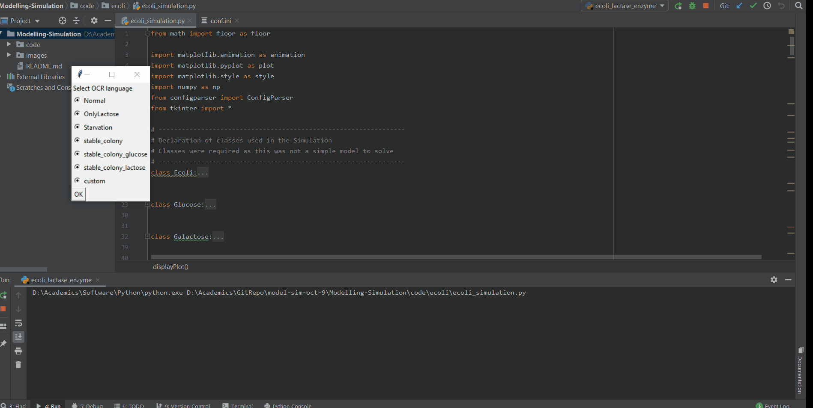
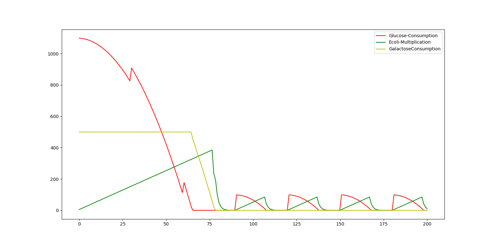

# Modelling-Simulation
Modelling and Simulation - University of Groningen

ecoli.py
  Simulates a theoritcal model of the Ecoli division and Glucose & Galactose consumption.
  The Ecoli cell division duration is downscaled from 20min to 2min to obtain a wider range on the graph.
 Sample Result
 
 
ecoli_experimental.py
 Work in progress model to simulate close to real world scenario.
 
