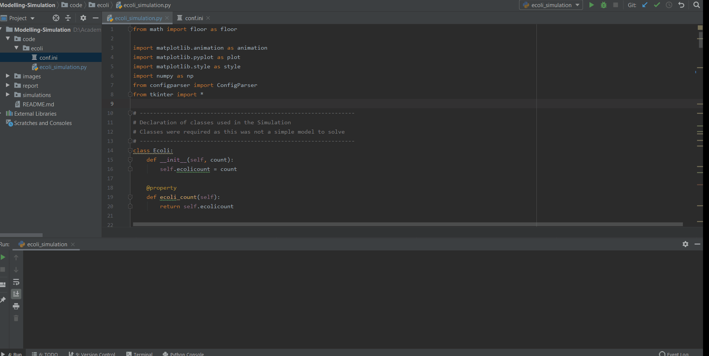
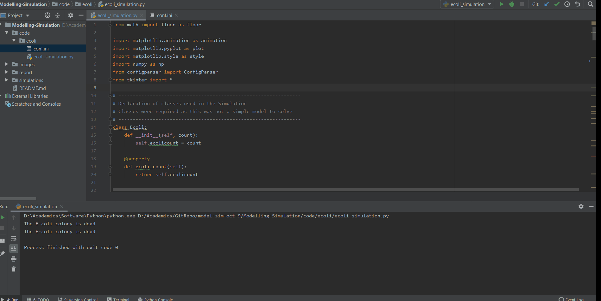
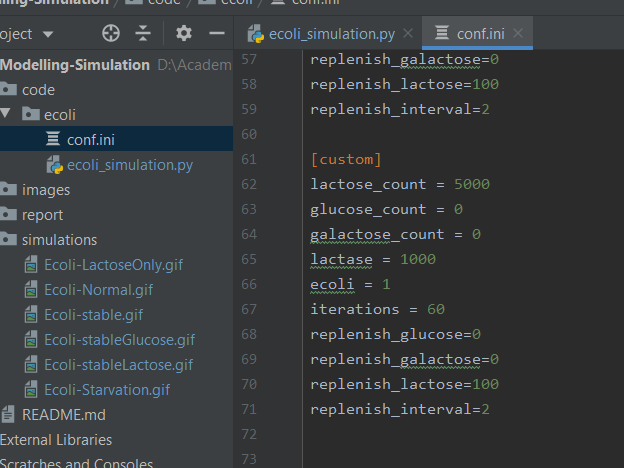
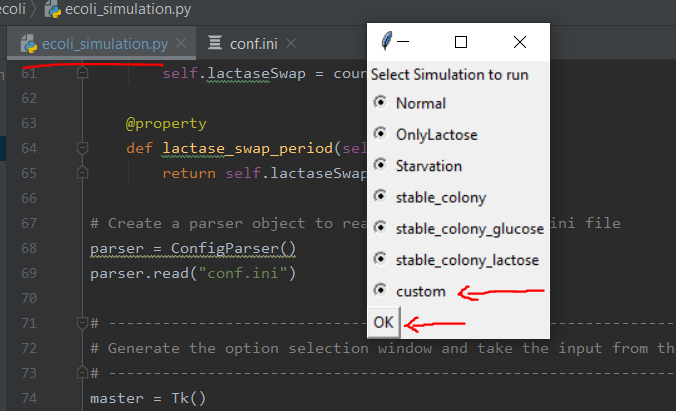

# Modelling-Simulation
# Modelling and Simulation - University of Groningen

## Simulation of Escherichia coli (E. Coli) Growth in Presence of VariousCarbon Sources
### Group - 19
### By, Swastik S Nayak (S4151968) & Siddharth Baskaran (S3922782).

**ecoli_simulation.py**  
  Simulates a theoritcal model of the Ecoli division and Glucose & Galactose consumption.
  The Ecoli cell division duration is downscaled from 20min to 2min to obtain a wider range on the graph.  
  A detailed report of the concept, modelling and simulation can be found in our **[report](https://github.com/Swastik-RUG/Modelling-Simulation/blob/dev/report/E_Coli_Colony_simulation_team_19_report.pdf)**  

### Simulations:
 
## Static Snapshots of the Simulation can be found in the [images/ folder](https://github.com/Swastik-RUG/Modelling-Simulation/tree/dev/images)  
 
## Ecoli Division under Normal scenario, without replenishment of food  
   
 
## Ecoli Division under Starvation scenario, without replenishment of food  
   

## Ecoli Division under Lactose Only scenario, without replenishment of food  
   
  
 ## Ecoli Division under Stable scenario, with replenishment of food  
   
 
 ## Ecoli Division under Stable Glucose and Galactose only scenario, with replenishment of food  
   
 
 ## Ecoli Division under Stable Lactose scenario, with replenishment of food  
   

## Create you Custom Simulations by following these steps

- Clone this repository
- Find the **"conf.ini"** file.
  
- Execute the **"ecoli_simulation.py"** and select **simulation mode "custom"**
  
- Done

